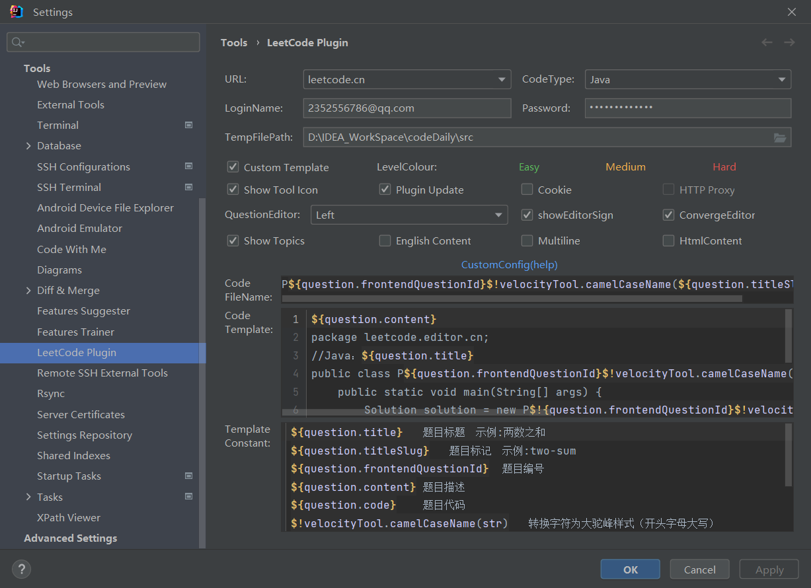

# codeDaily
+ 使用Java语言

+ 每日至少1题

+ 8月10号开始

  看看可以坚持多久。。。

#### leetcode-editor配置

###### Code FileName:

```java
P${question.frontendQuestionId}$!velocityTool.camelCaseName(${question.titleSlug})
```


###### Code Template:

```java
${question.content}
package leetcode.editor.cn;
//Java：${question.title}
public class P${question.frontendQuestionId}$!velocityTool.camelCaseName(${question.titleSlug}){
    public static void main(String[] args) {
        Solution solution = new P$!{question.frontendQuestionId}$!velocityTool.camelCaseName(${question.titleSlug})().new Solution();
        // TO TEST
    }
    ${question.code}
}

```



